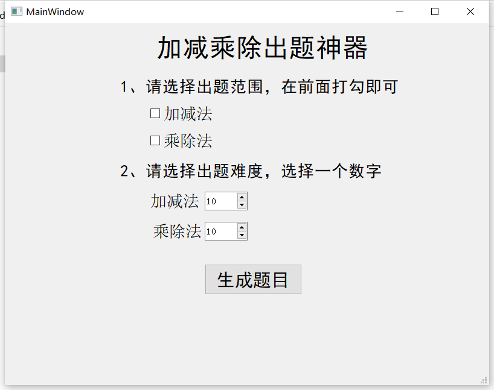

# generator
加减法生成神器

# 使用  
### v0.1 版本

 ./Generator.exe num 

num为10到100之间的整数，例如num为10，则生成的文件内容为10以内的加减法"

### v1.0 版本

上图中，可以选择加法和乘除法单独出题，也可以选择一起出题。第二个主要选择v出题范围，比如选择10，那就是10以内的加减法或者乘除法。最后生成的文件在软件所在的目录里面。